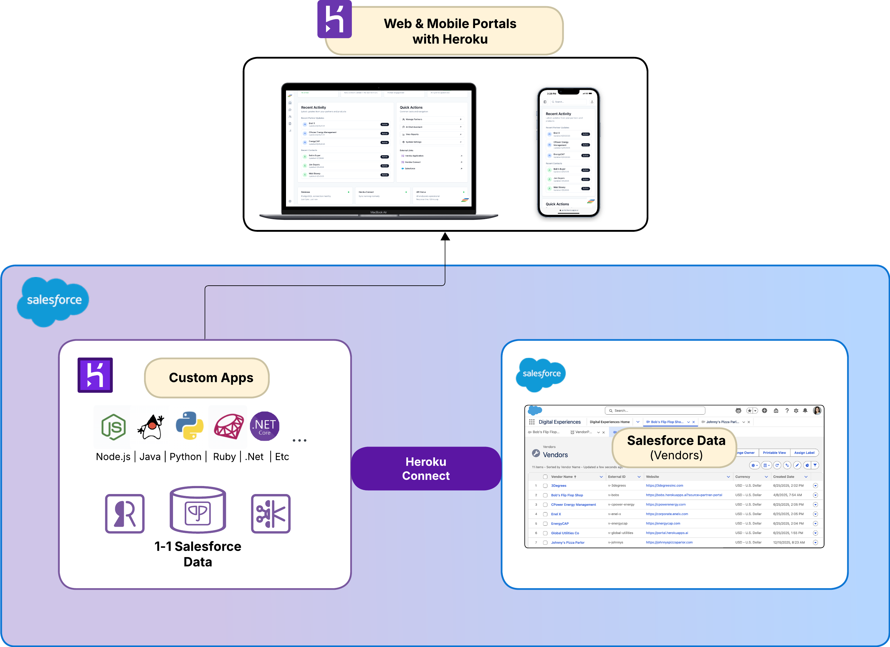

# Web Portal Template

<a href="https://deploy.herokuapps.ai?template=https://github.com/aagnone-sfhk/template-web-portal">
    
</a>

A modern, full-featured admin dashboard template built with Next.js 15, featuring AI chat capabilities, database integration, and a clean UI.



## Tech Stack

- **Framework**: [Next.js 15](https://nextjs.org) (App Router with Turbopack)
- **Language**: [TypeScript](https://www.typescriptlang.org)
- **Auth**: Simple username/password (cookie-based sessions)
- **Database**: [PostgreSQL](https://www.postgresql.org) with [Drizzle ORM](https://orm.drizzle.team)
- **Styling**: [Tailwind CSS](https://tailwindcss.com)
- **Components**: [Shadcn UI](https://ui.shadcn.com) + [Radix UI](https://www.radix-ui.com)
- **AI Chat**: Claude models via [Heroku AI Inference](https://www.heroku.com/ai)
- **Validation**: [Zod](https://zod.dev)

## Features

- 📊 Dashboard with stats and recent activity feeds
- 💬 AI Chat assistant with tool execution (Python, Node.js, Ruby, Go)
- 📋 Items list view with pagination and search
- 🔐 Simple username/password authentication
- 🎨 Clean, responsive UI with dark mode support
- 🔧 MCP (Model Context Protocol) server integration
- 📄 Content processing (HTML/PDF to Markdown)

## Getting Started

### Prerequisites

- Node.js 18+
- pnpm (v10.7.0+)
- PostgreSQL database
- Heroku AI Inference addon (for chat)

### Installation

```bash
# Clone the repository
git clone <your-repo-url>
cd template-web-portal

# Install dependencies
pnpm install

# Set up environment variables
cp .env.example .env
# Edit .env with your values

# Run development server
pnpm dev
```

Visit http://localhost:3000 to see your app.

## Environment Variables

### Required

| Variable | Description |
|----------|-------------|
| `DATABASE_URL` | PostgreSQL connection string |
| `AUTH_USERNAME` | Username for portal authentication |
| `AUTH_PASSWORD` | Password for portal authentication |
| `INFERENCE_URL` | AI inference endpoint URL |
| `INFERENCE_KEY` | API key for AI inference |
| `INFERENCE_MODEL_ID` | Model ID to use for inference |

### UI Configuration (Optional)

| Variable | Default | Description |
|----------|---------|-------------|
| `NEXT_PUBLIC_APP_TITLE` | "Admin Portal" | Application title |
| `NEXT_PUBLIC_APP_DESCRIPTION` | "Your intelligent AI assistant" | App description |
| `NEXT_PUBLIC_APP_INTRO_MESSAGE` | "Hello! I'm your AI assistant..." | Welcome message for AI chat |
| `NEXT_PUBLIC_LOGO` | "/af.png" | Logo image path |
| `NEXT_PUBLIC_AVATAR` | "/af.png" | Chat avatar path |
| `NEXT_PUBLIC_LOGO_ALT` | "Admin Portal" | Alt text for logo (accessibility) |
| `NEXT_PUBLIC_EVENT_HUB_URL` | "https://hub.herokuapps.ai" | Event hub URL |

### Salesforce AgentForce (Optional)

If you want to use Salesforce AgentForce integration:

| Variable | Description |
|----------|-------------|
| `SF_MY_DOMAIN_URL` | Your Salesforce My Domain URL |
| `SF_CONSUMER_KEY` | Connected App consumer key |
| `SF_CONSUMER_SECRET` | Connected App consumer secret |
| `SF_AGENT_ID` | Einstein Agent ID |

## Customization

### Database Schema

The template includes a generic `items` table in `lib/db.ts`. The table is auto-created and seeded with sample data on first run.

Schema:

```typescript
export const items = pgTable('items', {
  id: serial('id').primaryKey(),
  name: varchar('name', { length: 255 }),
  description: text('description'),
  status: varchar('status', { length: 50 }).default('active'),
  website: varchar('website', { length: 255 }),
  imageUrl: varchar('image_url', { length: 255 }),
  createdAt: timestamp('created_at').defaultNow(),
  updatedAt: timestamp('updated_at').defaultNow(),
});
```

### Adding New Pages

1. Create a new directory in `app/(dashboard)/`
2. Add a `page.tsx` file
3. Update navigation in `app/(dashboard)/layout.tsx`

### Theming

Customize colors in `tailwind.config.ts` and `app/globals.css`.

## Project Structure

```
├── app/
│   ├── (dashboard)/        # Dashboard routes (protected)
│   │   ├── chat/           # AI chat page
│   │   ├── items/          # Items list page
│   │   ├── customers/      # Customers page (placeholder)
│   │   └── layout.tsx      # Dashboard layout with nav
│   ├── api/                # API routes
│   │   ├── auth/           # Auth endpoints (login/logout)
│   │   ├── heroku-mia/     # AI chat endpoint
│   │   └── mcp-servers/    # MCP server endpoint
│   ├── chat/               # Chat components and logic
│   ├── config/             # Environment configuration
│   └── login/              # Login page
├── components/
│   └── ui/                 # Shadcn UI components
├── constants/              # App constants (agents, tools)
├── hooks/                  # Custom React hooks
├── lib/                    # Utilities, auth, and database
├── types/                  # TypeScript types
└── tests/                  # Integration tests
```

## Scripts

```bash
pnpm dev          # Start dev server with Turbopack
pnpm build        # Build for production
pnpm start        # Start production server
pnpm test         # Run tests
pnpm test:watch   # Run tests in watch mode
```

## Deployment

### Heroku (One-Click)

Click the "Deploy to Heroku" button at the top of this README to deploy with all required addons pre-configured.

### Heroku (Manual)

```bash
# Create app
heroku create your-app-name

# Add PostgreSQL
heroku addons:create heroku-postgresql:essential-0

# Add AI Inference
heroku addons:create heroku-inference:claude-4-5-sonnet

# Set required config vars
heroku config:set AUTH_USERNAME=<your-username>
heroku config:set AUTH_PASSWORD=<your-password>

# Deploy
git push heroku main
```

## License

MIT
